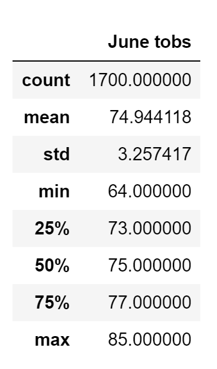
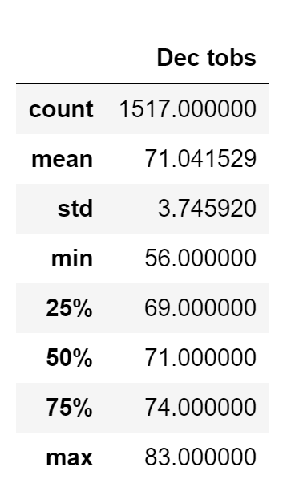

# surfs_up

  

## Table of Contents
* [Overview](https://github.com/rkaysen63/surfs_up/blob/master/README.md#overview)
* [Resources](https://github.com/rkaysen63/surfs_up/blob/master/README.md#resources)
* [Results](https://github.com/rkaysen63/surfs_up/blob/master/README.md#results)
* [Summary](https://github.com/rkaysen63/surfs_up/blob/master/README.md#summary)

## Overview:
The proposed business, "Surf n' Shake", will be a surfboard shop that also serves ice cream on the Island of Oahu.  An investor is very interested in the proposed business but has concern that poor weather could undermine its success.  The purpose of this analysis is to analyze the island's weather data and to evaluate its potential impact on the business' success or failure. 

## Resources 

* Database: hawaii.sqlite
* Software: Python 3.7.9 in Jupyter Notebook interface
* Lesson Plan: UTA-VIRT-DATA-PT-02-2021-U-B-TTH, Module 9 Challenge

## Results:
### June Summary Statistics

  

### December Summary Statistics

  

* Temperature
  * The temperature distribution is symmetrical in both June and December.  In other words, the mean and median for each month are the same.  In June the mean/median is 75/75 deg F.  In December, the mean/median is 71/71 deg F.  This implies that the island is not prone to extreme swings in temperature during those months.
  * The mean temperature in Dec, 71 deg F, is only 4 degrees lower than the mean temperature in June, 75 deg F.  This indicates that the island maintains a fairly consistent temperature throughout the year.
  * While the minimum temperature in December has dropped as low as 56 deg F, this occurs infrequently.  The mean temperature in December is 71 deg F with a standard deviation of 4 deg F, indicating that the temperatures in December tend to range between 67 deg F to 75 deg F.

* Precipitation

## Summary
* Throughout the year, the Island of Oahu maintains consistent and pleasant temperatures that are desirable for outdoor activities.

[Back to the Table of Contents](https://github.com/rkaysen63/surfs_up/blob/master/README.md#table-of-contents)
