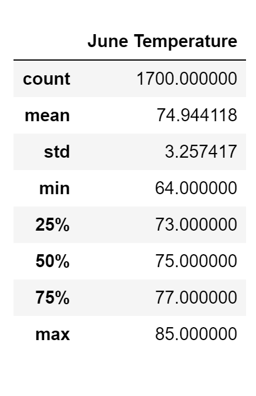
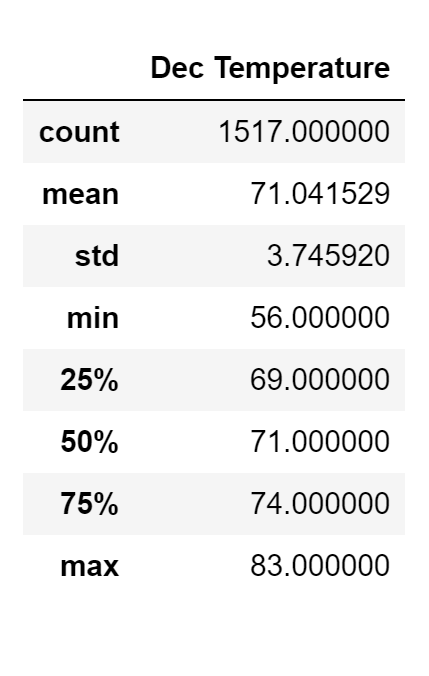
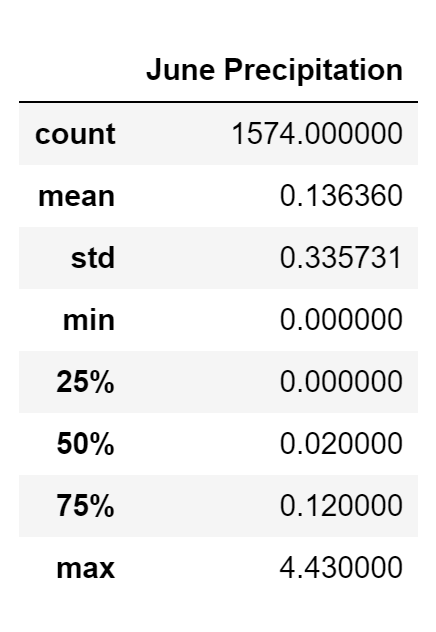
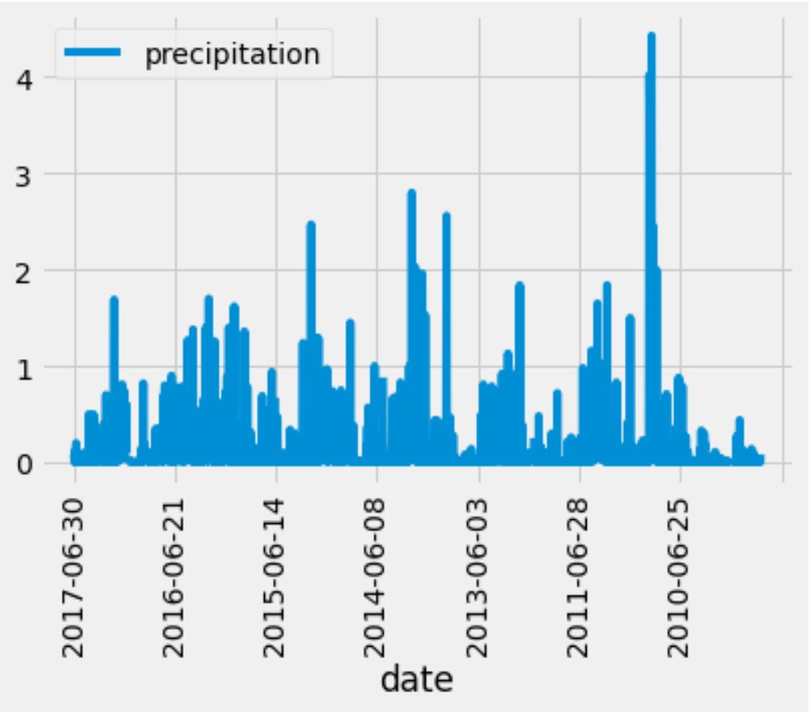
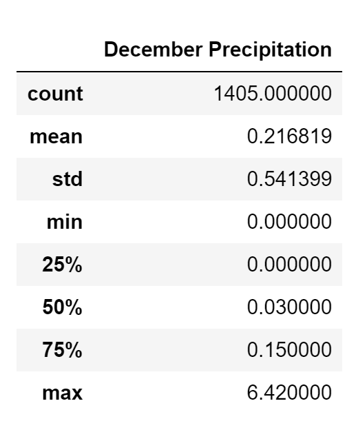
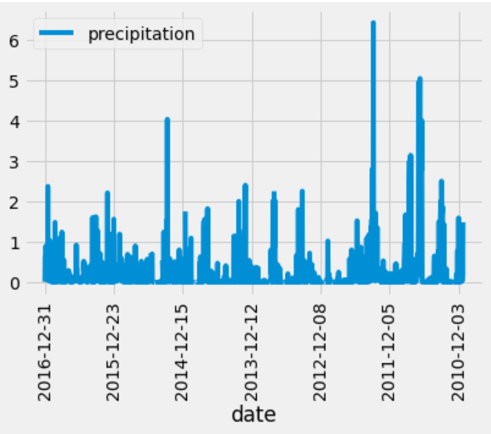

# surfs_up

  

## Table of Contents
* [Overview](https://github.com/rkaysen63/surfs_up/blob/master/README.md#overview)
* [Resources](https://github.com/rkaysen63/surfs_up/blob/master/README.md#resources)
* [Results](https://github.com/rkaysen63/surfs_up/blob/master/README.md#results)
* [Summary](https://github.com/rkaysen63/surfs_up/blob/master/README.md#summary)
* [Code](https://github.com/rkaysen63/surfs_up/blob/master/README.md#code)

## Overview:
"Surf n' Shake" is a proposed business that will be located on the Island of Oahu.  Not only will the business sell and rent surfboards and related gear, it will sell ice cream, too.  A well-known surfer is very interesting in investing in "Surf n' Shake" but has expressed concern that poor weather could undermine the business' success.  The purpose of this analysis is to analyze the island's weather data and to evaluate its potential impact on Surf n' Shake's" success or failure. 

## Resources 

* Database: hawaii.sqlite
* Software: Python 3.7.9 in Jupyter Notebook interface
* Lesson Plan: UTA-VIRT-DATA-PT-02-2021-U-B-TTH, Module 9 Challenge

## Results:

### Temperature Observations (TOBS)

### June TOBS - Summary Statistics

  

### December TOBS - Summary Statistics

  

* **Analysis of Results - Temperature Observations**
  * The data set only includes records from 2010 through 2017.  References to maximum and minimum temperatures refer to only the maximum and minimum in the database.
  * The temperature distribution is symmetrical in both June and December.  In other words, the mean and median for each month are the same.  In June the mean/median is 75oF/75oF.  In December, the mean/median is 71oF/71oF.  This implies that the island is not prone to extreme swings in temperature during those months.
  * The mean temperature in Dec, 71oF, is only 4oF lower than the mean temperature in June, 75oF.  This indicates that the island maintains a fairly consistent temperature throughout the year.
  * While the minimum temperature in December has dropped as low as 56 oF, this occurs infrequently.  The mean temperature in December is 71oF with a standard deviation of 4oF, indicating that the temperatures in December tend to range between 67oF to 75oF.
  * The maximum temperature in June is only 2oF higher than December.
  * December's temperatures drop a little lower than June's, but the difference is still not that great.  The minimum temperature for December is 56oF, where as June's minimum is 8oF higher.  

## Summary
Throughout the year, the Island of Oahu maintains consistent and mild temperatures from the low to mid 70's oF that are desirable for most water sports.  Temperature is not the only consideration.  An abundant amount of rain could have a devestating impact on a surfing business by discouraging all but the most dedicated surfers from hitting the beach. For this reason additional queries for June and December precipitation measurements were retrieved and statistics run.  While large amounts of rainfall have been recorded the stats show that this is the exception rather than the rule.  Median rainfall is 0.02" in June and 0.03" in December. Based on this weather analysis, the proposed business on the Island of Oahu could be a success!

### Precipitation

* June Precipitation

   

* December Precipitation

   

* **Analysis of Results - Precipitation*

  * The results show that the precipitation is generally light with a smattering of heavier rainfall.  Median rainfall is 0.02" in June and 0.03" in December.
  * Unlike the temperature distribution, the precipitation data is skewed right in June and December.  The mean precipitation in both June and December is greater than the 3rd quartile for those months.  This indicates that there are days with a large amount of rainfall, but those days are the exception rather than the rule.
  * The scatter plot shows that there are few days with over 1 inch of rainfall in either June or December over seven years of data; fewer days with over 2 inches; and almost no days with greater than 3" of rainfall.  

## Code
* **Code for making a connection to a database and reflecting that database**  
  
      # Dependencies
      import numpy as np
      import pandas as pd

      # matplotlib toolkit
      %matplotlib inline
      from matplotlib import style
      style.use('fivethirtyeight')
      import matplotlib.pyplot as plt
      from sqlalchemy import extract

      # Python SQL toolkit and Object Relational Mapper
      import sqlalchemy
      from sqlalchemy.ext.automap import automap_base
      from sqlalchemy.orm import Session
      from sqlalchemy import create_engine, func
    
      # Establish connection with SQLite
      engine = create_engine("sqlite:///hawaii.sqlite")

      # reflect an existing database into a new model
      Base = automap_base()
      # reflect the tables
      Base.prepare(engine, reflect=True)

      # Save references to each table
      Measurement = Base.classes.measurement
      Station = Base.classes.station
  
      # Create our session (link) from Python to the DB
      session = Session(engine)
 
      # Display the row's columns and data in dictionary format
      first_row = session.query(Measurement).first()
      first_row.__dict__
 
 * **Code for December's Summary Statistics for Temperature Observations**  
   The code for June's Summary Statistics for Temperature Observations follows the same pattern, but change the filter to `.filter(extract('month', Measurement.date) == 6)`.
  
       # Retrieve the temperature observation data for December
       dec_temps = session.query(Measurement.tobs).filter(extract('month', Measurement.date) == 12).order_by(Measurement.date.desc())

       # Convert the December temperatures to a list.
       dec_tobs = []

       for row in dec_temps:
       dec_tobs.append(row)
       # Confirm list.    
       print (dec_tobs)

       # Create a DataFrame from the list of temperatures for the month of December. 
       dec_tobs_df = pd.DataFrame(dec_tobs,columns=['Dec Temperature'])
       # Confirm DataFrame.
       dec_tobs_df.head()

       # 9. Calculate and print out the summary statistics for the Decemeber temperature DataFrame.
       dec_tobs_df.describe()

  * **Code for June's Summary Statistics for Precipitation and a Precipitation Plot**  
   The code for December's Summary Statistics for Precipitation follows the same pattern, but change the filter to `.filter(extract('month', Measurement.date) == 12)`.
    
        # Retrieve the precipitation data for June
        june_results = session.query(Measurement.date, Measurement.prcp).filter(extract('month', Measurement.date) == 6).order_by(Measurement.date.desc()).all()
       
        # Save query results as a Pandas DataFrame.
        june_prcp_df = pd.DataFrame(june_results, columns=['date','precipitation'])
       
        # Calculate and print out the summary statistics for the June Precipitation DataFrame.
        june_prcp_df.describe()
      
        # Set the index to the date column
        june_prcp_df.set_index(june_prcp_df['date'], inplace=True)
       
        # Plot total precipitation per day in June.
        june_prcp_df.plot(rot=90)

[Back to the Table of Contents](https://github.com/rkaysen63/surfs_up/blob/master/README.md#table-of-contents)
